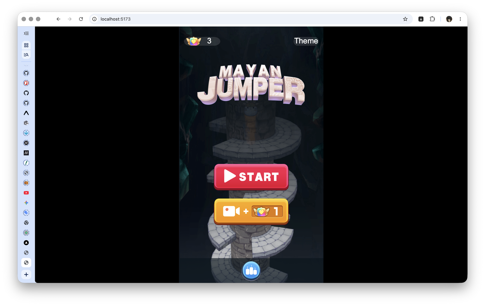
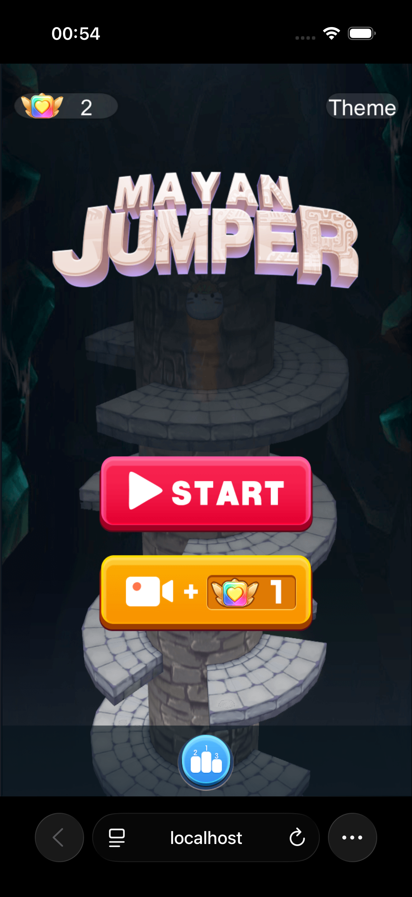

# Mayan Jump 2 — Enhanced Web Port

**▶ [Play now](https://mayan-plus.vercel.app)**

Enhanced fork of the [Mayan Jump 2 web port](https://github.com/ladhahq/mayan-web) — a 3D endless jumper extracted from the last public Android APK (2018) by BadDog Game. This fork adds **character skins**, **coin rewards**, **revive mechanic**, **leaderboard**, and a modern **TypeScript + Vite** toolchain.

| Desktop | Mobile |
|---------|--------|
|  |  |

**📝 [Read the full backstory](https://jisena.bearblog.dev/how-i-ported-an-abandoned-android-game-to-the-web-in-a-few-hours-with-ai/)** — how the original port was built, step by step.

## Quick Start

```bash
pnpm install
pnpm dev
```

Open `http://localhost:5173` in a browser with WebGL support.

```bash
pnpm tsc --noEmit   # type-check
pnpm build           # production build → dist/
```

## How It Works

The original game was built with **LayaAir v2.1.3.1** and wrapped in **LayaNative** (Conch) for Android. The APK was essentially a web app in a native shell. This port removes the native wrapper and runs the game directly in the browser.

The original web port was vanilla JS. This fork adds:

| Layer | Stack |
|-------|-------|
| **Build tool** | Vite 8 |
| **Language** | TypeScript 5 |
| **Package manager** | pnpm |
| **Game engine** | LayaAir v2.1.3.1 (vendored, untouched) |
| **Game logic** | `jump3d.max.js` (unmodified) |

Game scripts stay as classic `<script>` tags to preserve load order. TypeScript modules handle shims, patches, bootstrapping, and new features — with full type safety via ambient declarations for the LayaAir engine and game classes.

## Project Structure

```
mayan-plus/
├── index.html                  Entry point
├── package.json                Vite + TypeScript
├── tsconfig.json
├── vercel.json                 Cache headers
│
├── laya.js                     LayaAir v2.1.3.1 engine (vendored, untouched)
├── utils.min.js                Game utilities (unmodified)
├── jump3d.max.js               Game logic (unmodified)
│
├── src/
│   ├── main.ts                 Module entry
│   ├── boot.ts                 Body sizing, canvas check, audio unlock,
│   │                           revive enable, home UI patches
│   ├── conch-shim.ts           Conch/LayaNative API stubs
│   ├── fix-aspect-ratio.ts     Engine patches (aspect ratio + mouse coords)
│   ├── skin.ts                 Character skin system
│   ├── character-picker.ts     Skin picker dialog
│   ├── leaderboard.ts          Leaderboard dialog + score submission
│   ├── rewards.ts              Coin economy (milestones, combos, daily)
│   ├── supabase.ts             Supabase client
│   ├── style.css
│   └── types/
│       ├── laya.d.ts           LayaAir engine ambient types
│       └── game.d.ts           Game class ambient types
│
├── supabase/
│   ├── schema.sql              Database tables + RLS + RPC
│   ├── deno.json               Deno config for Edge Functions
│   └── functions/submit-score/ Edge Function (score submission)
│
├── game/                       Game textures
├── home/                       Home screen textures
├── settle/                     Settlement screen textures
├── sound/                      WAV sound effects
├── font/                       layabox.ttf (Chinese font, 10MB)
│
├── res/atlas/                  Sprite atlases
├── Role.ani                    2D player animation
├── JumpEffect_*.ani            Jump effect animations
│
├── tools/
│   ├── analyze-mesh.py         Parse .lm binary mesh files
│   └── extract-texture.py      Crop UV-mapped texture regions
│
├── LayaScene_JumpDown/         Main cylinder scene (3D)
├── LayaScene_Role/             Player character + textures + skins
├── LayaScene_JumpCircle/       Combo circle effect
├── LayaScene_JumpCircleBig/    Big combo circle effect
├── LayaScene_GoingDown/        Fire trail effect
└── LayaScene_Trail/            Trail effect
```

## Engine Patches

Two bugs in the LayaAir engine were fixed to make the game work on desktop browsers. These now live in `src/fix-aspect-ratio.ts` (TypeScript, served as a classic script by Vite).

### 1. Portrait Aspect Ratio

The engine uses `window.innerWidth/innerHeight` to size the WebGL framebuffer. On desktop (landscape ~16:9), this clips the portrait game (750×1334). **Fix:** Override `Browser.clientWidth/clientHeight` to return portrait-proportioned values.

### 2. Mouse Coordinate Mapping

`_canvasTransform.invertTransformPoint()` doesn't account for the canvas element's CSS offset. **Fix:** Patch to subtract `getBoundingClientRect()`, correcting hit-testing when the game is centered via CSS `translate(-50%, -50%)`.

## Custom Skins

The character texture is a **3-column sprite sheet** animated by UV offset switching. Add skins by dropping a PNG into the texture folder and registering it in `src/skin.ts`.

### Technical Spec

| Property | Value |
|----------|-------|
| **Canvas size** | 512 × 128 pixels |
| **Format** | PNG, RGBA (with alpha) |
| **Layout** | 3 equal columns (~171px each), left to right |
| **Column 0 (idle)** | Normal/neutral pose |
| **Column 1 (action)** | Angry/determined pose |
| **Column 2 (hurt)** | Knocked-out/dizzy pose |
| **Centering** | Each sprite centered vertically in its column |
| **Background** | Transparent |

The material uses `tilingOffset: [0.333, 1, 0, 0]` — one column visible at a time. Animations slide the U-offset. Sprites must not bleed into adjacent columns.

### Adding a Skin

1. Create a sprite sheet matching the spec above, e.g. `role-cat.png`
2. Drop it in `LayaScene_Role/Assets/Texture/`
3. Register it in `src/skin.ts`:

```ts
const SKINS: Record<string, string> = {
  default: 'LayaScene_Role/Assets/Texture/role.png',
  bunny1:  'LayaScene_Role/Assets/Texture/role-b1.png',
  bunny2:  'LayaScene_Role/Assets/Texture/role-b2.png',
  cat:     'LayaScene_Role/Assets/Texture/role-cat.png', // ← add this
};
```

4. Refresh. In the dev console:

```js
setSkin('cat')
```

The skin persists in `localStorage` under `character_skin`. Hot-swappable during gameplay. A proper UI selector is planned.

## Platform & Environment Textures

The game's cylinder body, platforms, and walls all sample from two texture atlases. Each 3D mesh maps to a specific pixel region via baked UV coordinates. The UV-to-pixel mapping was reverse-engineered from the binary `.lm` mesh files (see `tools/analyze-mesh.py`).

### Scene_Mid.png (1024×1024) — Normal Mode

The default material applied to all meshes during normal gameplay.

| Mesh | Pixel Region | Size | Game Object |
|------|-------------|------|-------------|
| SceneStatic | X:654–1015, Y:0–1023 | 362×1024 | Cylinder body (vertical strip, right ~35%) |
| NormalCube | X:173–612, Y:8–575 | 440×568 | Normal platform blocks |
| DamageCube1 | X:21–622, Y:8–763 | 602×756 | Trap blocks |
| DamageCube2 | X:10–622, Y:631–1015 | 613×385 | Wall obstacles |

### Burning.png (256×256) — Combo Fire Mode

Applied to platforms and walls when combo ≥ 3. The cylinder body keeps using Scene_Mid.png.

| Mesh | Pixel Region | Size | Game Object |
|------|-------------|------|-------------|
| NormalCube | X:43–153, Y:2–143 | 111×142 | Normal platform (burning) |
| DamageCube1 | X:5–155, Y:2–190 | 151×189 | Trap block (burning) |
| DamageCube2 | X:2–155, Y:157–253 | 154×97 | Wall obstacle (burning) |

### Creating Platform Textures

Use `tools/extract-texture.py` to isolate any region:

```bash
# Extract cylinder body from Scene_Mid.png
python tools/extract-texture.py Scene_Mid.png --x0 654 --x1 1015 --y0 0 --y1 1023 --bleed 4

# Extract all regions at once
python tools/extract-texture.py Scene_Mid.png --auto --output-dir out/
```

The mesh UVs are stored in binary `.lm` files. Use `tools/analyze-mesh.py` to inspect any mesh:

```bash
python tools/analyze-mesh.py LayaScene_JumpDown/Assets/model/
```

## Leaderboard & Auth

The 🏆 button on the home screen opens a live leaderboard (top 20).

- **Sign in** — magic link (email only, no password). Tap "Sign in to save scores" to get started.
- **Submit scores** — on death, your best score, combo, coins, and skin are submitted via a Supabase Edge Function.
- **Only your best** — the database keeps your highest score. Lower scores are ignored.
- **Display name** — prompted once on first sign-in, stored in your profile.

### Supabase Backend

| What | Where |
|------|-------|
| Schema | `supabase/schema.sql` — profiles, scores, coins tables with RLS |
| Edge Function | `supabase/functions/submit-score/` — validates auth, calls `submit_score()` RPC |
| Client | `src/supabase.ts` + `src/leaderboard.ts` |

### Environment Variables

Set these in Vercel for production:

```
VITE_SUPABASE_URL=https://<your-project>.supabase.co
VITE_SUPABASE_PUBLISHABLE_KEY=sb_publishable_...
```

For local dev, copy `.env.example` (or create `.env` — it's gitignored).

## Coins & Rewards

Coins are earned during gameplay and spent on revives.

| Trigger | Reward |
|---------|--------|
| Score milestones (250, 500, 750, 1000, 1500, 2000) | +1–5 coins |
| Combo streaks (2×, 5×, 10×, 15×, 20×) | +1–5 coins |
| New personal high score | +3 coins |
| Daily first visit | +2 coins |
| Welfare button (home screen) | Visual only (no-op) |

Revive costs **3 coins** — one revival per game. Coin cap: 99. Rewards are patched into the game's score setter and fire immediately during gameplay with a staggered coin icon popup.

## Browser Compatibility

Tested on iPhone 16 (iOS 18) and desktop (macOS).

| Browser | Platform | Centered | Fits viewport | Notes |
|---------|----------|----------|---------------|-------|
| Safari | iOS | ✅ | ✅ | Perfect |
| Opera | iOS | ✅ | ✅ | Perfect |
| Arc Search | iOS | ✅ | ✅ | Perfect |
| Chrome | iOS | ✅ | ❌ | Centered, black side margins |
| Firefox | iOS | ✅ | ❌ | Centered, black side margins |
| Chrome | desktop | ✅ | ❌ | Letterboxed on wide screens |
| Firefox | desktop | ✅ | ❌ | Letterboxed on wide screens |
| Safari | desktop | ✅ | ❌ | Letterboxed on wide screens |

**Known issue:** Chrome iOS and Firefox iOS don't fill the viewport width. Safari, Opera, and Arc Search handle this correctly. Pull requests welcome.

## Known Limitations

- **Background music**: Not in the APK assets (likely handled by Android native layer)
- **Ads, ranking, video rewards**: Android-specific, stubbed via `conch-shim.ts`
- **Audio autoplay**: Chrome blocks audio until first interaction; engine auto-recovers
- **Font**: 10MB `layabox.ttf` for Chinese text; English-only users can omit it

## Future Enhancements

Ideas for upcoming features:

| Category | Ideas |
|----------|-------|
| **Competitive** | Weekly leaderboard resets, friend challenges (share a link to beat a score) |
| **Progression** | Unlockable skins (reach 1000 for a gold skin), achievement badges |
| **Gameplay** | Power-ups (slow-mo, shield, magnet), themed seasons (Halloween blocks, Christmas cylinder) |
| **Social** | Spectate mode, ghost replay of top scores |
| **Monetization** | Coin packs (TZS 500 → 30 coins via payment webhook) |
| **Polish** | PWA install prompt, haptic feedback, sound toggle |
| **Coin authority** | Migrate coin storage from localStorage to Supabase `coins` table for server-side integrity |
| **Daily challenge** | Same seed for everyone, one attempt per day — gives a natural "ending" |

The `coins` table in the database exists for this migration. Currently coins are stored in `localStorage` (client-side). When a signed-in player submits a score, their coin balance is recorded. Phase 2 moves the entire economy server-side for tamper-proof balances.

## Gameplay

- **Resolution**: 750×1334 portrait
- **Controls**: Tap/drag left/right to rotate the cylinder. Player auto-jumps on blocks
- **Mechanics**: Combo system, fire mode (combo ≥ 3), walls (instant death), trap blocks
- **Scenes**: Home → Game → Revive/Settle dialogs

## Credits

- Original game by BadDog Game (http://www.baddog-game.com)
- Built with LayaAir by LayaBox (http://www.layabox.com)
- Web port reverse-engineered from the 2018 Android APK
- Bunny character skins from [Kenney Jumper Pack](https://kenney.nl/assets/jumper-pack) (CC0)
